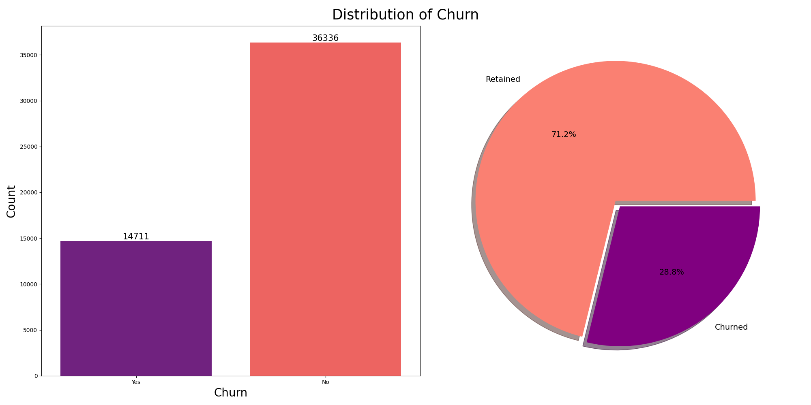

# 📉 Telecom Customer Churn Prediction
 
Predicting customer churn for a telecom company using machine learning. Built on the [Cell2Cell Telecom Churn Dataset](https://www.kaggle.com/datasets/jpacse/datasets-for-churn-telecom/data) from Kaggle.
 
---
 
## 📌 Problem Statement
 
Customer churn is one of the most costly challenges in the telecom industry. Retaining an existing customer is significantly cheaper than acquiring a new one. This project is aimed at building a classification model to identify customers at risk of churning, enabling the business to take proactive retention action.
 
---
 
## 📂 Dataset
 
- **Source:** [Kaggle - Cell2Cell Telecom Churn](https://www.kaggle.com/datasets/jpacse/datasets-for-churn-telecom/data)
- **Train set:** 51,047 records with Churn labels
- **Test set:** 20,000 Unlabeled records for prediction
- **Target variable:** `Churn` (binary- 1: Churned, 0: Retained)
- **Features:** Customer demographics, usage patterns, billing info, service interactions and more
 
---
 
## 🛠️ Methodology
 
1. **Data Cleaning**: handled missing values, fixed data types, dropped high-null columns
2. **Feature Engineering**: created features such as `OfferAcceptanceRate` and `CustomerSupportMonth` and ` FinancialDistressScore`
3. **Exploratory Data Analysis (EDA)**: analyzed churn distribution, feature correlations and customer segments
4. **Preprocessing Pipeline**: scaling, encoding using the `ColumnTransformer`
5. **Class Imbalance**: addressed using SMOTETOMEK sampling on training data only
6. **Modeling**: trained and tuned three gradient boosting models:
   - XGBoost ✅ (best performer)
   - LightGBM
   - CatBoost 
7. **Hyperparameter Tuning**: `RandomizedSearchCV` with 5-fold cross validation
8. **Threshold Optimization**: adjusted decision threshold to `≥ 0.3` to maximize recall on minority class
 
---
 
## 📊 Results
 
**Best Model: XGBoost**
 
 Metric ---------Score \
ROC-AUC 0.67 \
Precision (Churn) 0.40 \
Recall (Churn) 0.60 \
F1-Score (Churn) 0.48 \
 
> Recall was prioritized as the key metric because in a churn context, missing a churner is more costly than a false alarm.
 
### Churn Distribution

 
---
 
## 🔍 Key Insights
 
- Roughly **41.92%** of customers in the test_data are predicted to churn
- Customers were segmented into risk levels: **Low, Medium, High and Critical**
- Top drivers of churn identified in terms of feature importances include PrizmCode, Occupation, customer service interactions (MadeCallToRetentionTeam and CustomerSupportCalls), Credit rating.
-Most of the customers have a Credit rating between 1-3, and customers with a credit rating in that range are most likely churn as compared to those with a credit rating of 5+
-Only 1,745 customers called retention vs 49,302 who didn't and 45% oof those who did churned, compared to the 28.2% of those who called but did not churned, which goes to show that customers who make calls to the retention team are most likely to churn.
---
 
## 🗂️ Project Structure
 
```
├── train.csv
├── test.csv
├── churn_prediction.ipynb
├── churn_distribution.png
└── README.md
```
 
---
 
## ▶️ How to Run
 
1. Clone the repository
2. Install dependencies:
```bash
pip install pandas numpy scikit-learn imbalanced-learn xgboost lightgbm catboost matplotlib seaborn
```
3. Download the dataset from [Kaggle](https://www.kaggle.com/datasets/jpacse/datasets-for-churn-telecom/data) and place `train.csv` and `test.csv` in the root folder
4. Run `churn_prediction.ipynb` end to end
 
---
 
## 👤 Author
 
**Nitamo Olefhile**  
[Kaggle Profile](https://www.kaggle.com/nitamoolefhile)
 
---
