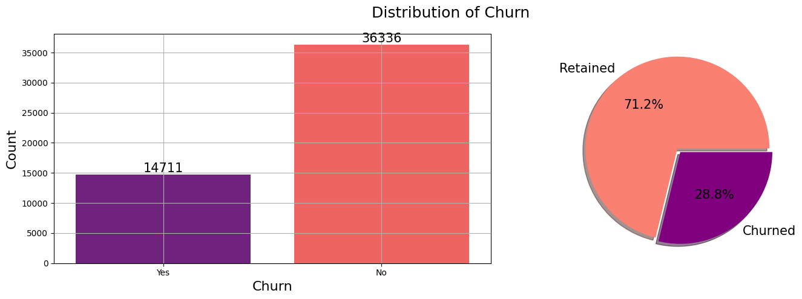

# Telecom Customer Churn Prediction
 
Predicting customer churn for a telecom company using machine learning. Built on the [Cell2Cell Telecom Churn Dataset](https://www.kaggle.com/datasets/jpacse/datasets-for-churn-telecom/data) from Kaggle.
 
---
 
## Problem Statement
 
Customer churn is one of the most costly challenges in the telecom industry. Retaining an existing customer is significantly cheaper than acquiring a new one. This project is aimed at building a classification model to identify customers at risk of churning, enabling the business to take proactive retention action.
 
---
 
## Dataset
 
- **Source:** [Kaggle - Cell2Cell Telecom Churn](https://www.kaggle.com/datasets/jpacse/datasets-for-churn-telecom/data)
- **Train set:** 71,047 records with Churn labels
- **Test set:** 20,000 Unlabeled records for prediction
- **Target variable:** `Churn` (binary- 1: Churned, 0: Retained)
- **Features:** Customer demographics, usage patterns, billing info, service interactions and more
 
---
 
## Methodology
 
1. **Data Cleaning**: handled missing values, fixed data types, dropped high-null columns
2. **Feature Engineering**: created features such as OfferAcceptanceRate and CustomerSupportMonth and FinancialDistressScore
3. **Exploratory Data Analysis (EDA)**: analyzed churn distribution, feature correlations and customer segments using RFM analysis
4. **Preprocessing Pipeline**: scaling, encoding using the ColumnTransformer
5. **Class Imbalance**: addressed using class weights
6. **Modeling**: trained and tuned three gradient boosting models:
   - XGBoost 
   - LightGBM
   - CatBoost ✅ (best performer)
7. **Hyperparameter Tuning**: RandomizedSearchCV with 5-fold cross validation
8. **Threshold Optimization**: adjusted decision threshold to ≥ 0.40 to maximize recall on minority class
 
---
 
## Results
 
**Best Model: CatBoost**
 
 Metric ---------Score \
ROC-AUC 0.67 \
Precision (Churn) 0.40 \
Recall (Churn) 0.65 \
F1-Score (Churn) 0.50 \
Though CatBoost was the best performer out of all the 3 models, it didn't really achieve desirable metrics. The model has a precision score of 40% on predicting customers that would churn, which means that out of all predicted customers that were predicted to churn, only 40% were churners and 60% were false alarm. Out of all customers who actually churned, the model correctly identified 65% of them.

Obviously there is still a lot of work that needs to be done in terms of improving model performance.
 
### Churn Distribution

 
---
 
## Key Insights
 
- Roughly **41.92%** of customers in the test_data are predicted to churn
- The RFM analysis showed that majority of the customers are loyal customers with also a significant fraction of those who we have already lost or are about to lose.
- Majority of the customers have a good credit score and also coming from a good income group.
- Customers were segmented into churn risk levels: **Low, Medium, High and Critical**
-Most of the customers have a Credit rating between 1-3, and customers with a credit rating in that range are most likely churn as compared to those with a credit rating of 5+
-Customers which normally make calls to the retention teams often indicate dissatisfaction or disapproval of a particular service, and those are the customers that normally attrition.
- Top drivers of churn identified in terms of feature importances include duration of current device, duration of customer, monthly minutes, customer service interactions (MadeCallToRetentionTeam and CustomerSupportCalls), Credit rating.
---
 
## Project Structure
 
```
├── train.csv
├── test.csv
├── churn_prediction.ipynb
├── churn_distribution.png
└── README.md
```
## 👤 Author
 
**Nitamo Olefhile**  
[Kaggle Profile](https://www.kaggle.com/nitamoolefhile)
 
---
