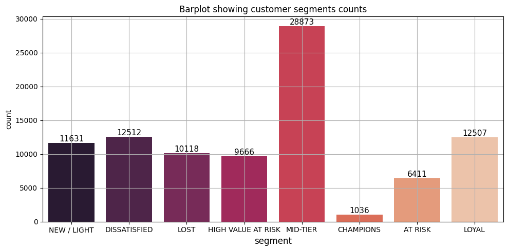

# Customer Segmentation Project
 
Customer segmentation for a Brazilian E-commerce store called Olist using unsupervised machine learning. Built on the [Olist Dataset](https://www.kaggle.com/datasets/olistbr/brazilian-ecommerce) sourced from Kaggle.
 
---
 
## Problem Statement

Not all customers will spend the same and not all customers will be satisfied with the products or services provided by the business. It is up to the business to figure out a way to make all the customers happy. One way of doing that is performing, customer segmentation. Customer segmentation is a process whereby customers are divided into groups based on their needs, behaviors and characteristics. It allows the business to understand why a certain group of customers behave a certain way, so as to provide counteractive measures. It is one of the most important techniques for businesses to date.
 
## Dataset
 
- **Source:** [Olist Dataset]( https://www.kaggle.com/datasets/olistbr/brazilian-ecommerce)
- **Dataset:** 119143 records which includes information on customers, orders, geographic location, sellers and order reviews.
- **Features:** 'shipping_limit_date', 'price', 'freight_value',
       'product_category_name', 'seller_city', 'seller_state',
       'payment_type',  'payment_value', 'review_id', 'review_score', 'review_comment_message'..etc

 
---
 
## Methodology
 
1. **Data Cleaning**: Merged the data from customer data, order data, product data, geo data etc. Removed duplicates and filled any missing data.
2. **Exploratory Data Analysis (EDA)**: analyzed feature distribution using histograms, feature correlations using heatmaps and performed RFM analysis for segment groups.
3. **Preprocessing Pipeline**: scaling, encoding using the ColumnTransformer
4. **Feature Engineering**: Aggregating data 
5. **Modeling**: 
   - KMeans Clustering
   - DBscan (later used it for outlier detection)
   - KMeans Clustering (final) after filtering outliers detected using DBscan ✅ (best algorithm)
6. **Cluster Profiling**: Deep dived into what the clusters actually mean for the business

---

### Customer Segmented Groups using RFM Analysis

 
---
 
## Key Insights
 
- Customer satisfaction appears to be relatively high, with an average review score of 4 out 5, which indicates that majority of the customers are satisfied with the products being offered.
- Customers typically make purchases worth around 172.06 and prefer paying in installments, and they average 3 installments per order. This suggests that installments play a he role in purchasing behavior and affordability of our customers.
- Majority of the customers are mid-level customers who don’t spend too much nor do they spend too little. Their spending is considered reasonable. Only a small fraction of the customers are big spenders. This would suggest that the revenue of the business is mostly driven by mid-level purchasing rather than big spenders.
Cluster Profiling:
•	cluster (-1): Deemed outliers, they are considered our highest spenders, moderately satisfied.
•	cluster (0): low value customers, with an average spending of 106.79 but highly satisfied.
•	cluster (1): Our regular customers, spending 214.80 on average, very satisfied as well.
•	cluster (2): low value customers, low spenders, not satisfied with the products/service, we might be at risk of losing them.
•	cluster (3): High value customers, spends a decently high amount, very satisfied, many installments.
---
 
## 👤 Author
 
**Nitamo Olefhile**  
[Kaggle Profile](https://www.kaggle.com/nitamoolefhile)
 
---
