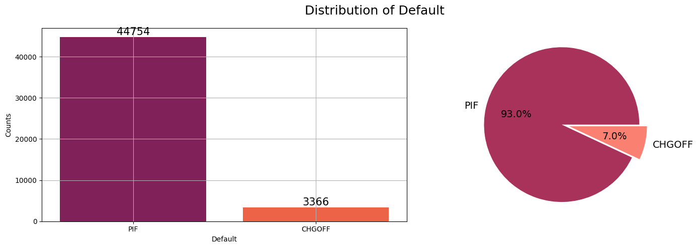

# Loan Default Prediction
 
Predicting loan default for a US agency called US. Small Business Administration (SBA) using machine learning. Built on the [US. SBA Dataset](https://data.sba.gov/dataset/7-a-504-foia/resource/d67d3ccb-2002-4134-a288-481b51cd3479) from the US. SBA website.
 
---
 
## Problem Statement

Loan default is a situation where a borrower fails to pay back the amount borrowed as per agreed terms, which violates the agreement set in place. This is a challenge that continues to persist in financial institutions leading to crippling financial losses which reduces the instituions investment muscle. This project aims to build models that will predict the probability that a borrower will default on their loan. The inisghts gathered will then be used to encourage informed decision making and the implementation of timely intervention measures to mitigate defaults.
 
## Dataset
 
- **Source:** [US. SBA data](https://data.sba.gov/dataset/7-a-504-foia/resource/d67d3ccb-2002-4134-a288-481b51cd3479)
- **Dataset:** 347514 records which includes 'Charged-off labels' as our defaults within the Loan Status variable, along other categories such as PaidInFull, Exempt etc.
- **Target variable:** `Default` (binary- 1: 'CHGOFF', 0: PIF)
- **Features:** borrower related features, loan related features
 
---
 
## Methodology
 
1. **Data Cleaning**: filtered the dataset to only include data ranging from 2019-2022 as my training set and used 2023 data as my test set because some loans had not matured for them to be used. Then proceeded to handled missing values, fixed data types, dropped high-null columns
2. **Exploratory Data Analysis (EDA)**: analyzed feature-default relations, feature correlations and default segment groups
3. **Preprocessing Pipeline**: scaling, encoding using the ColumnTransformer
4. **Modeling**: trained and tuned three gradient boosting models:
   -Logistic Regression
   -Random Forest
   - XGBoost 
   - LightGBM
   - CatBoost ✅ (best performer)
5. **Class Imbalance**: Used SMOTE technique
6. **Hyperparameter Tuning**: RandomizedSearchCV with 5-fold cross validation
7. **Threshold Optimization**: adjusted decision threshold to ≥ 0.35 to maximize recall on minority class
 
---
 
## Results
 
**Best Model: CatBoost**
 
Metric--------------------Score \
ROC-AUC----------------0.9783 \
Precision (default)-------0.78 \
Recall (default)----------0.84 \
F1-Score (default--------0.80 \
LightGBM and CatBoost pretty much recorded the same metrics, but CatBoost was ahead on ROC-AUC score with a minimal margin, hence selected as the best performing model. The 78% prediction score means that out of all the predicted defaulters, 78% were actual defaulters, meaning that the remaining 22% were not actual defaulters, which is not bad. The 84% mon recall means that out of the borrowers that defaulted, the model managed to predicted 85% of them, which is very exceptional.
 
### Loan default Distribution

 
---
 
## Key Insights
 
- Relatively newer businesses have a higher default rate compared to other business, maybe because of not having a well established cashflow since they are new unlike those that have been operating for longer.
- Businesses which have a variable interest rate have the more likelihood of defaulting on their loans, because of the varying interest rates, unlike those who have a fixed rate.
- Businesses without collateral have a high default rate compared to those with collateral.
-Most of the customers have a Credit rating between 1-3, and customers with a credit rating in that range are most likely churn as compared to those with a credit rating of 5+
-Customers which normally make calls to the retention teams often indicate dissatisfaction or disapproval of a particular service, and those are the customers that normally attrition.
- Strong predictors of loan default include duration of the loan, loan amount, loan interest, type of interest rate. Features such as how the loan processed, type of the business, franchise or not, offered no contribution to the performance of the model.
---
 
## Project Structure
 
```
├── foia-7a-fy2020-present-asof-250930.csv  #too big to upload
├── loan_default_prediction.ipynb
├── default_distribution.png
└── README.md
```
## 👤 Author
 
**Nitamo Olefhile**  
[Kaggle Profile](https://www.kaggle.com/nitamoolefhile)
 
---
